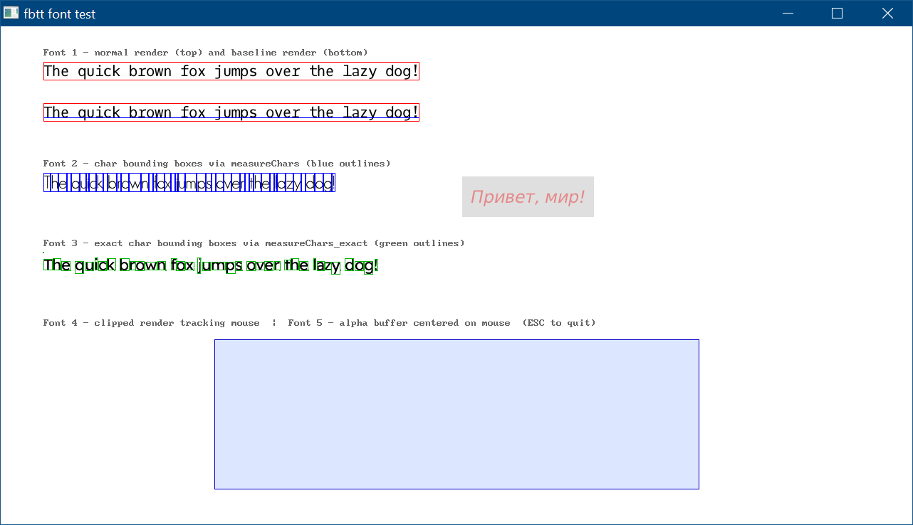
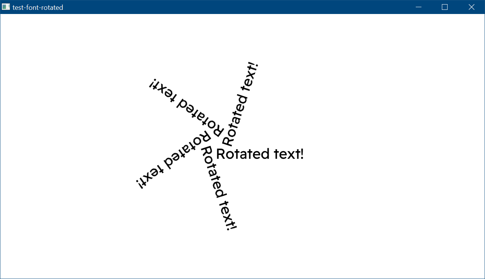

# FreeBasic TrueType/OpenType library

Library based on Sean Barret's public domain stb_truetype.

Supports drawing to image buffers, text measuring and char glyph bounding box retrieval, arbitrary clipping, rotation and proper alpha blending support. Unicode is partially supported via FreeBasic's native Unicode support (`wstring`).

Pre-built static libs for Windows are provided (tested on Win 10), and source code is also provided for compilation on Linux.

To use it in your projects, just copy the `fbtt` folder to your project folder (with the appropriate binaries in there if you've compiled them) and include `fbtt-font.bi`. For static libraries, no other dependency is needed.

Example code showing the features is included as a reference, and to show how you can integrate it into your projects.
